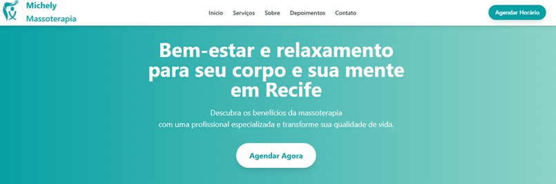
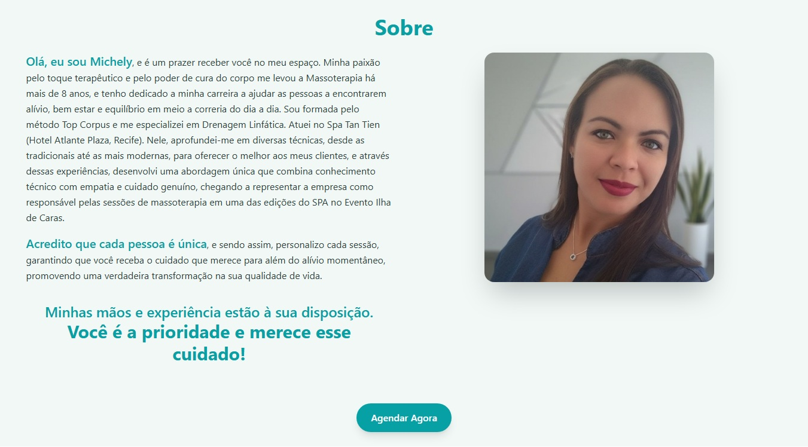
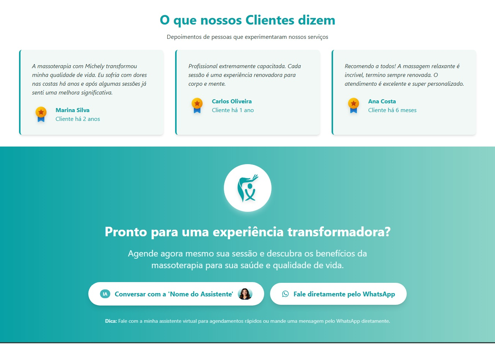
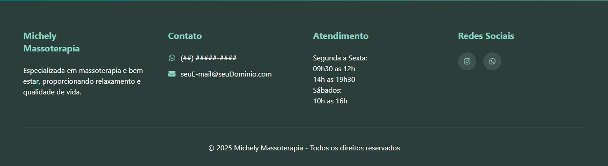
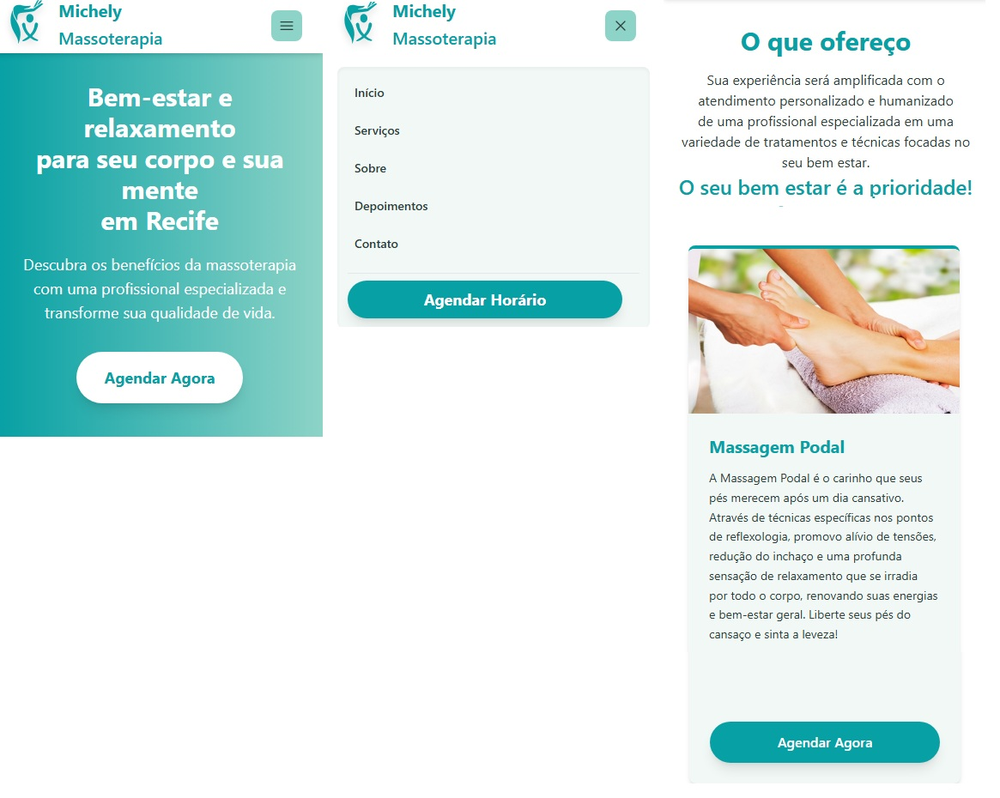
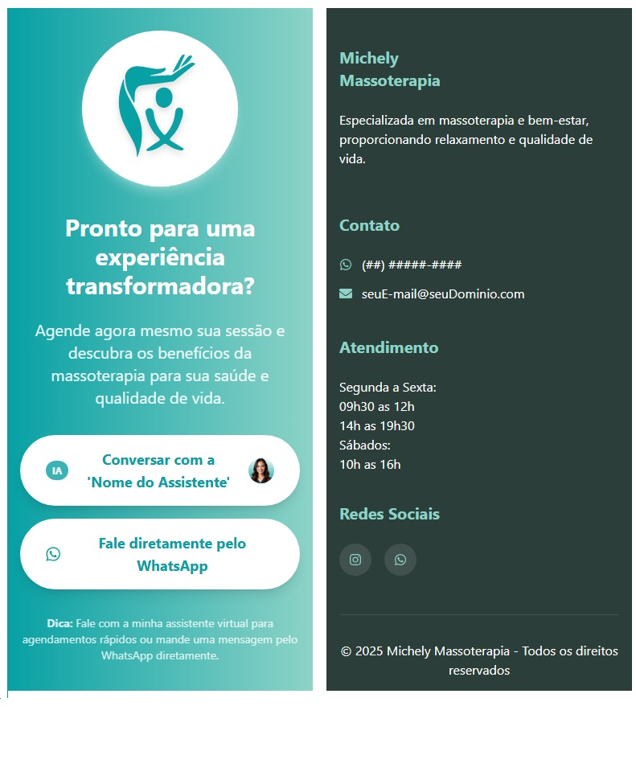

# <a href="https://reactjs.org/" target="_blank" rel="noreferrer"> </a><a href="https://tailwindcss.com/" target="_blank" rel="noreferrer"> </a>Landing Page 
___
#  Michely Massoterapia


> Projeto profissional desenvolvido para cliente do ramo da massoterapia, oferecendo uma experiência digital moderna e conversiva.

## 🎯 Preview
### 💻 Desktop

| Seção Principal | Serviços | Sobre |
|-----------------|----------|-------|
|  |  |  |

| Depoimentos | Footer |
|-------------|--------|
|  |  |

### 📱 Mobile

| Header, Hero, Menu e Serviços | Sobre e Depoimentos | CTA e Footer |
|-----------------|----------|-------|
|  |  |  |

## ✨ Sobre o Projeto

Landing page moderna e responsiva desenvolvida para promover serviços especializados em massoterapia e bem-estar, focada em conversão e experiência do usuário. A página está integrada com a plataforma da JotForm, que fornece uma agente virtual para atendimento e informações ao cliente. A agente também possui um formulário integrado e controle de agendamento registrado na Google Agenda da empresa.

## 🛠️ Stack Tecnológica

### Frontend
- **React 19** - Framework principal
- **Tailwind CSS** - Estilização e utilitários
- **Vite** - Build tool e dev server

### Bibliotecas
- **React Icons** - Ícones vetoriais
- **Heroicons** - Ícones complementares

### Ferramentas:

- <a href="fonts.google.com" target="_blank" rel="noreferrer">   Google fonts - Tipografia online</a><br />
- <a href="netlify.com" target="_blank" rel="noreferrer">   Netlify - Hospedagem Gratuita</a><br />
- <a href="https://www.jotform.com" target="_blank" rel="noreferrer">   JotForm - Integração com formulários e agentes virtuais</a><br />
- <a href="https://chat.deepseek.com/" target="_blank" rel="noreferrer">   DeepSeek - Vibe Coding e Refinamento de Código</a><br />
-  Google AI Tools - Vibe Coding e Refinamento de Código <br />
    1 - <a href="https://aistudio.google.com/app" target="_blank" rel="noreferrer">Google AI Studio</a><br />
    2 - <a href="https://gemini.google.com/app" target="_blank" rel="noreferrer">Google Gemini</a><br />

## 🚀 Funcionalidades

### Core Features
- ✅ Design 100% responsivo (mobile-first)
- ✅ Navegação suave entre seções
- ✅ Carrossel interativo de serviços
- ✅ Formulário de contato integrado em uma agente Virtual construída na [JotForm](https://www.jotform.com)

## 🎨 Design System & UX/UI

- **Paleta de cores** relaxante baseada em tons de verde
- **Tipografia** legível e profissional
- **Animações** suaves e interativas
- **Layout** limpo e focado na conversão
- **Imagens** otimizadas e de alta qualidade

### SEO & Performance
- ✅ Otimização para mecanismos de busca
- ✅ Carregamento rápido e otimizado
- ✅ Meta tags e structured data
- ✅ Acessibilidade (ARIA labels)

## 📊 Status do Projeto - **Concluído** ✅

**Hospedagem**: Netlify  
**Site de Produção**: [Michely Massoterapia - https://michelymassoterapia.netlify.app/](https://michelymassoterapia.netlify.app/).

## 📞 Contato

Desenvolvido por **Carlos Lopes "Sk8"** <br/>
<a href="www.linkedin.com/in/carlos-lopes-b445aa201" target="_blank" rel="noreferrer"> </a> <a href="https://github.com/CHCLopes" target="_blank" rel="noreferrer"> </a>

## 📦 Instalação e Desenvolvimento

```bash
# Clone o repositório
git clone https://github.com/CHCLopes/ProjetoMassoterapia

# Instale as dependências
npm install

# Execute em modo desenvolvimento
npm run dev

# Build para produção
npm run build