

  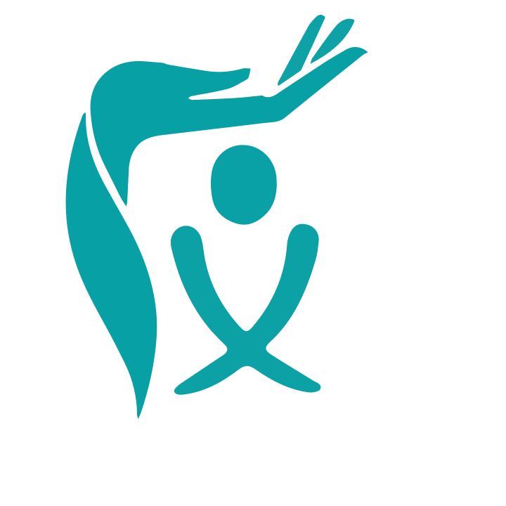
  
  # Michely Massoterapia | Landing Page 🌿
  
  **Uma experiência moderna de bem-estar, traduzida em código de alta performance e design sofisticado.**

  
  
  
  
  

 

## 📖 Visão Geral

Este projeto consiste na refatoração completa e modernização da Landing Page do espaço Michely Massoterapia. A arquitetura legada foi substituída por uma **Stack Moderna e Escalável**, garantindo máxima performance, manutenibilidade e uma experiência de usuário (UX) premium.

Utilizado **React 19** tipado com **TypeScript** e estilizado através do **Tailwind CSS v4**. O ecossistema é gerenciado pelo **Vite** para garantir um processo de *build* super rápido e pelo **Vitest** para assegurar a qualidade contínua através de testes unitários.

---

## 📸 Interface e Layout

| Modo Claro (Padrão) | Modo Escuro (Glassmorphism) |
| :---: | :---: |
| 🌞 Design original da marca, focado em leveza e relaxamento. | 🌙 Contrastes profundos e imersivos para descanso visual. |
|  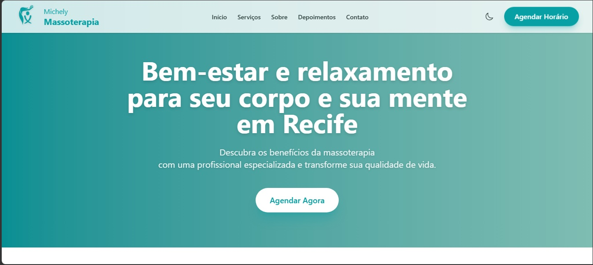 | 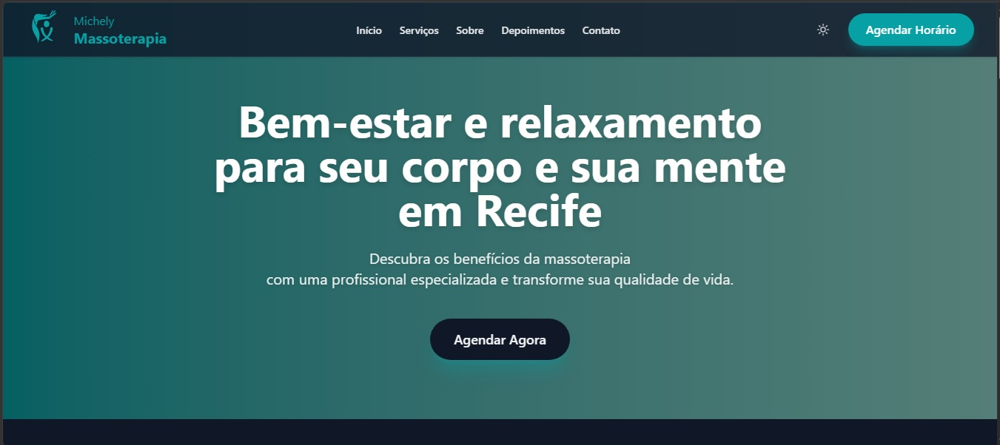 |
| Seção Principal | Serviços | Sobre |
|-----------------|----------|-------|
| 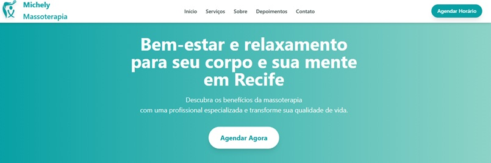 | 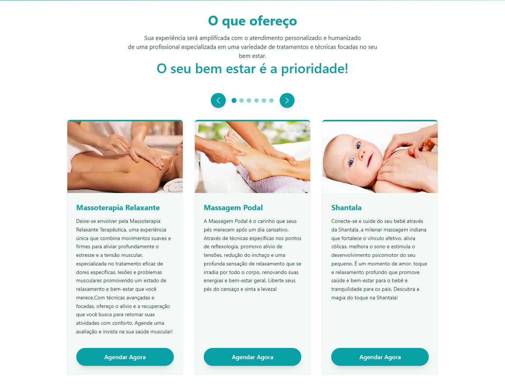 | 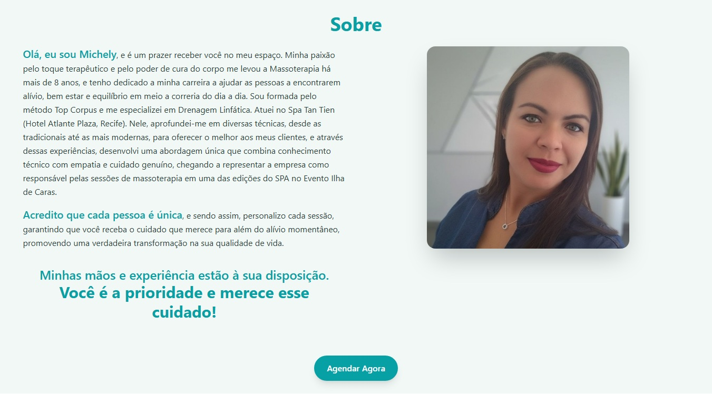 |

| Depoimentos | Footer |
|-------------|--------|
| 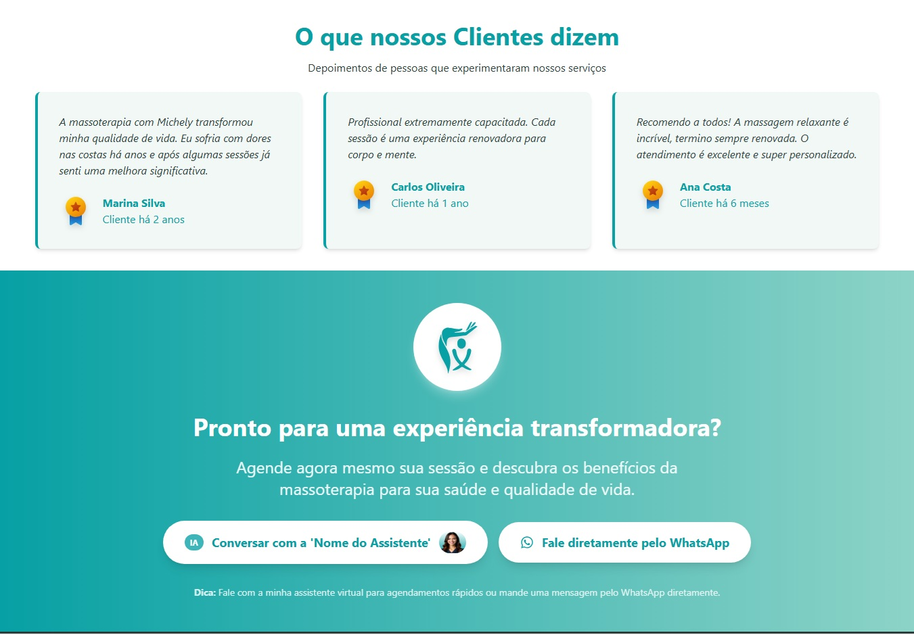 | 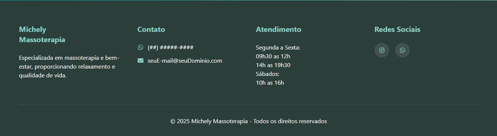 |

### 📱 Mobile

| Header, Hero, Menu e Serviços | Sobre e Depoimentos | CTA e Footer |
|-----------------|----------|-------|
| 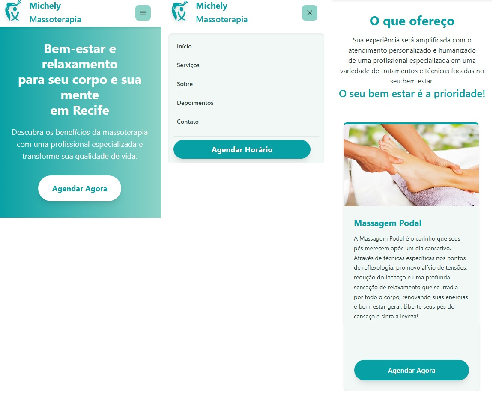 | 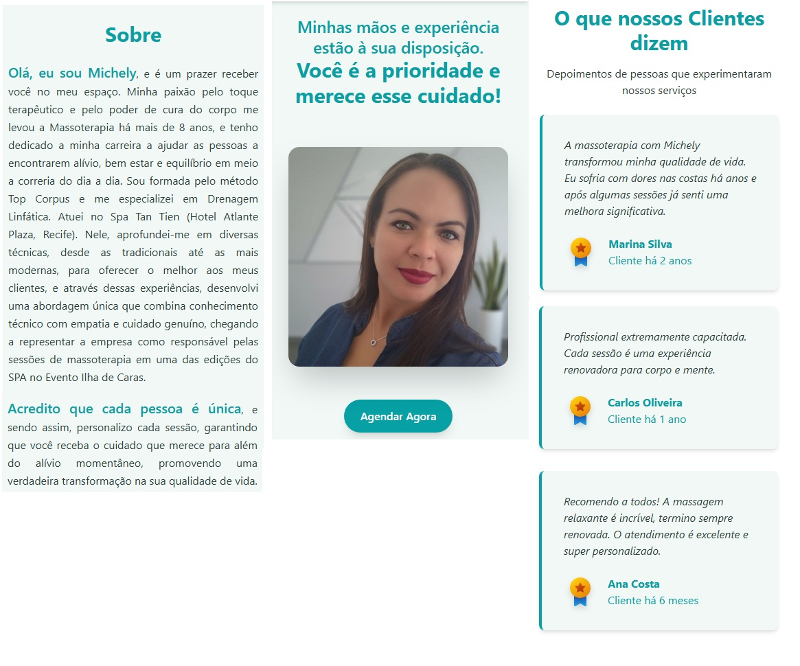 | 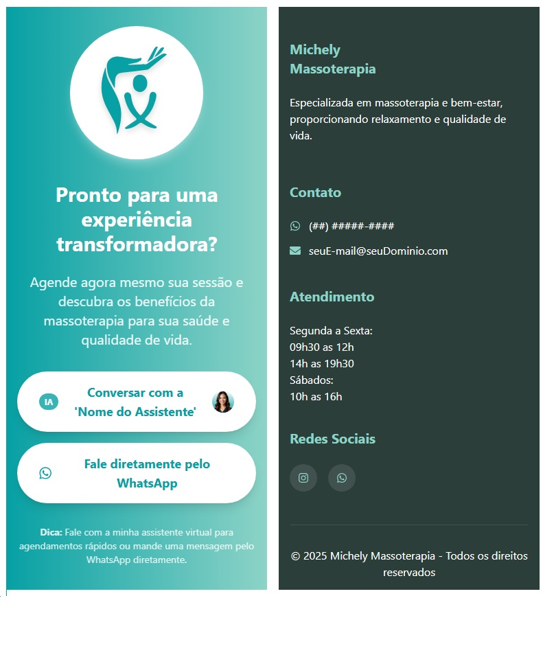 |

---

## 🚀 Atualizações e Melhorias Arquiteturais

A transição arquitetural trouxe grandes avanços focados não apenas em estética, mas em engenharia e autonomia de negócios:

*   🌗 **Dark Mode Inteligente:** O modo escuro foi cuidadosamente isolado da preferência de sistema do SO do usuário utilizando a funcionalidade `@custom-variant dark (&:where(.dark, .dark *))` nativa do Tailwind v4. Isso garante que a identidade visual *clara e terapêutica* original da marca seja sempre a primeira impressão, sendo alterada apenas mediante interação explícita do usuário no botão de alternância (Toggle).
*   ♿ **Acessibilidade (A11y):** Implementação rigorosa de atributos ARIA (`aria-labels`, `roles`, `aria-hidden`) nos botões, carrossel e modais. Aliada a uma estrutura HTML5 altamente semântica, a plataforma agora suporta navegação por teclado e otimização impecável para leitores de tela.
*   ⚡ **Performance & SEO:** Refinamento dos artefatos multimídia, adicionando `loading="lazy"` nas imagens pesadas e implementação completa das principais **Metatags** SEO (Open Graph, Twitter Cards, Description e Keywords) diretamente no `index.html`.
*   💎 **Design System & Glassmorphism:** O CSS global foi limpo em prol de componentes utilitários reutilizáveis, como o `.glass` e `.glass-card`. O **Carrossel de Serviços** foi refatorado para utilizar puramente as APIs nativas do CSS (`scroll-snap-type: x mandatory`), eliminando dezenas de linhas de scripts pesados focados no mouse e garantindo suavidade absoluta no carregamento via *mobile*.
*   🤖 **Integração JotForm Autônoma:** Inserimos uma assistente virtual treinada através da plataforma JotForm. O cliente interage via Chatbot e todo o fluxo de agendamento é processado e enviado diretamente para a agenda do Google da massoterapeuta, proporcionando 100% de independência de sistemas complexos de terceiros.

---

## 🛠️ Guia de Manutenção (Para futuros Devs)

Este projeto foi reescrito seguindo estritamente as diretrizes do princípio **DRY (Don't Repeat Yourself)**. Para garantir a longevidade do código, siga as práticas estruturais abaixo:

1. **Gestão de Dados e Conteúdo:**
   * A estrutura visual foi completamente separada dos dados. Se for necessário adicionar, remover ou editar novos serviços no carrossel, **basta atualizar o arquivo de dados** respectivo (ex: `src/data/servicesData.ts` ou lista mapeada equivalente) e o componente se ajustará dinamicamente, mantendo o *scroll snap* perfeito. Nunca repita HTML/Componentes manualmente.
2. **Atualização da Identidade Visual:**
   * Todas as variáveis-chave (cores, fontes e keyframes) do projeto não estão dispersas. Elas encontram-se centralizadas na diretiva `@theme` dentro de `src/index.css`.
   * Para alterar as cores principais da empresa, altere os tokens `var(--color-primary)`, `var(--color-secondary)`, `var(--color-accent)` e as classes geradas pelo Tailwind v4 adaptarão toda a interface.
3. **Escalando Animações:**
   * Reutilize as classes `animate-slide-up` e `animate-fade-in` junto à *Intersection Observer API* global (`useIntersectionObserver`) para manter a uniformidade cinemática nas novas seções.

---

  Desenvolvido com dedicação para elevar o bem-estar visual do usuário tanto quanto o corporal! ✨

